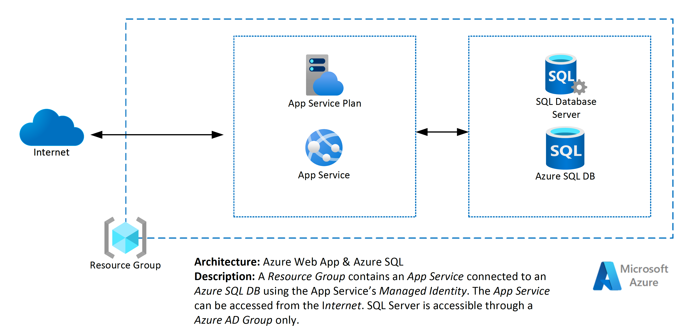

# Introduction

The Azure WebApp and Azure SQL template provisions a Resource Group that contains an App Service connected to an Azure SQL DB using the App Service's Managed Identity.  The App Service can be accessed from the internet.  SQL Server is accessible through an Azure AD Group only.

## Diagram

## Pre-requisites

1. An active Microsoft Azure Subscription with provisioning and service principal permissions
2. Azure DevOps Environment with Deployment capability to an Azure subscription
3. An Azure DevOps Service Connection

## Getting Started

The template contains 3 folders.

1. `/docs` - Contains the architecture diagram of the template and supporting documentation
2. `/iac` - Contains Infrastructure as Code (BICEP) and Azure Pipelines (YAML) that can be triggered from Azure DevOps to create the infrastructure in an Azure Subscription
3. `/src` - Contains a demo application written in .NET

## `docs`

1. Contains the architecture diagram of the template and supporting documentation.

## `iac`

1. `bicep`
    - This template uses [Bicep](https://learn.microsoft.com/en-us/azure/azure-resource-manager/bicep/overview?tabs=bicep) for Azure resource provisioning. Bicep is Microsoft's modern declarative Infrastructure-As-Code language that borrows some syntax from modern tooling like Terraform, but is backwards and forwards compatible with Azure Resource Manager (ARM). Bicep can be converted to ARM (and ARM converted to Bicep) via the `bicep` CLI.
    - Three environments are created as part of the provisioning process: DEV, QA, and Prod. Some aspects of configuration have been exposed as parameters, which can be modified in the appropriate file under the `parameters` folder.

2. `pipelines`
   - Pipelines are designed in Azure Pipelines YAML. Pipeline parameters can be reviewed and modified under the `templates/variables` folder.
   - There are two pipelines:
     - Infrastructure provisioning (`deploy.infrastructure.yml`)
     - Application deployment (`build.and.deploy.application.yml`)

Some teams prefer to manage infrastructure provisioning and management separately from application build and deployment. Other teams treat the infrastructure as an ever-evolving application requirement that is deployed on every release, alongside the application code. There are advantages and disadvantages to both approaches.

## `src`

Contains a simple Todo List application that stores user-created todo items in a SQL PaaS database.
Application authenticates to SQL via a the web application's Managed Service Identity, so no passwords or keys need to be persisted.
SQL migrations are automatically applied on application start-up.
